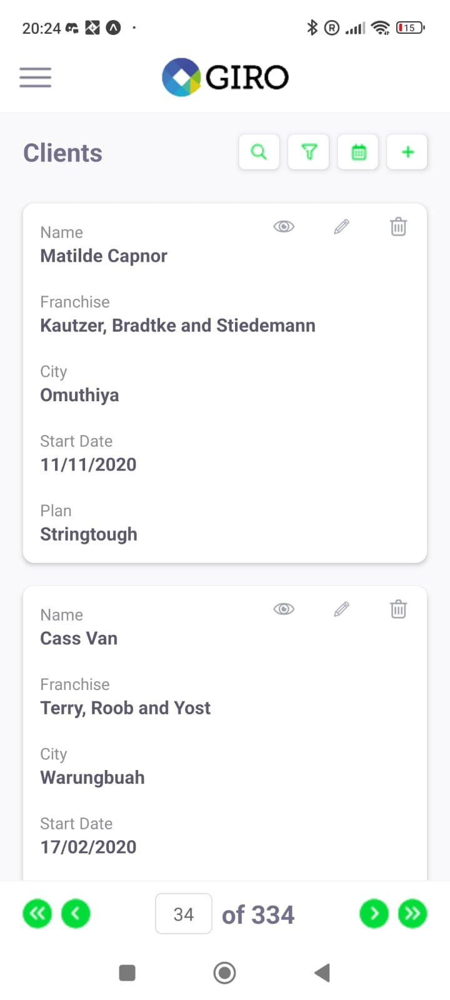
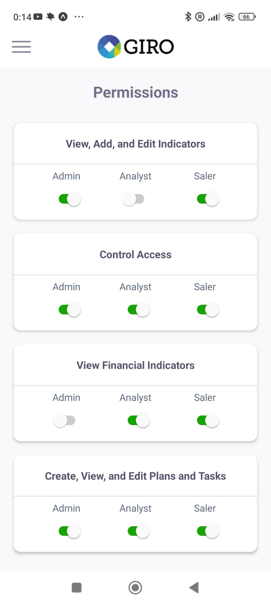
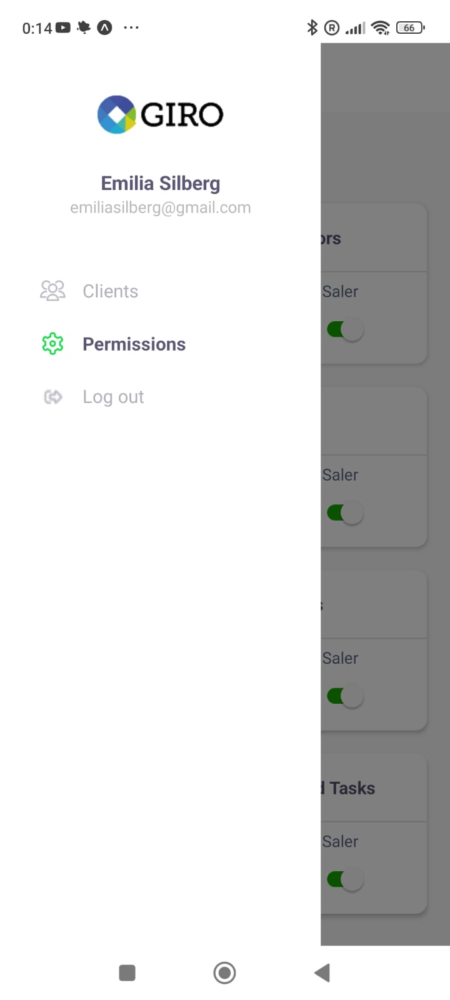

# Giro Tech Test App

This project is a mobile application developed for a technical test. It was built using React Native, Expo, and TypeScript.

## Screenshots






## Demo version

[Link](https://booking-test-app-seven.vercel.app/)

## Installation

To get started with the project, follow these steps:

1. Install dependencies:

```sh
npm install
```

## Available Scripts

In the project directory, you can run the following scripts:

- `npx expo start`
- `npx expo start --android`
- `npx expo start --ios`
- `npx expo start --web`
- `npm test`

## Dependencies

- **@react-navigation/drawer:** ^6.6.6
- **@react-navigation/native:** ^6.1.9
- **@react-navigation/native-stack:** ^6.9.17
- **@reduxjs/toolkit:** ^2.0.1
- **expo:** ~49.0.15
- **expo-status-bar:** ~1.6.0
- **react:** 18.2.0
- **react-native:** 0.72.6
- **react-native-gesture-handler:** ^2.12.0
- **react-native-reanimated:** ~3.3.0
- **react-native-safe-area-context:** 4.6.3
- **react-native-screens:** ~3.22.0
- **react-native-skeletons:** ^1.3.5
- **react-redux:** ^9.0.4
- **redux:** ^5.0.1

## Dev Dependencies

- **@babel/core:** ^7.20.0
- **@jest/globals:** ^29.7.0
- **@testing-library/jest-native:** ^5.4.3
- **@testing-library/react-native:** ^12.4.3
- **@types/jest:** ^29.5.11
- **@types/redux-mock-store:** ^1.0.6
- **jest:** ^29.7.0
- **jest-expo:** ^49.0.0
- **redux-mock-store:** ^1.5.4
- **typescript:** ^5.1.3
